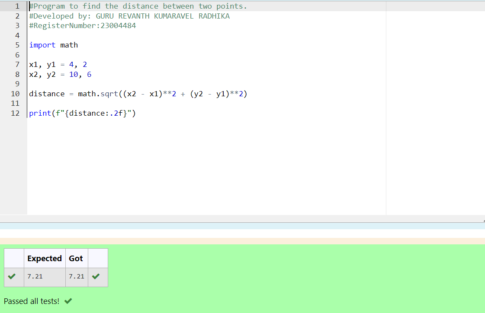

# DISTANCE-BETWEEN-TWO-POINTS

## AIM:
To write a python program to find the distance two 2 points

## ALGORITHM:
### Step 1: 
Import numpy into the editor
### Step 2: 
Input the co-ordinates to calculate the distance between them
### Step 3: 
Substitute the values in the distance formula  
### Step 4: 
Print the solution
### Step 5:
End the program 

### PROGRAM:
```
#Program to find the distance between two points.
#Developed by: GURU REVANTH KUMARAVEL RADHIKA
#RegisterNumber:23004484

import math

x1, y1 = 4, 2
x2, y2 = 10, 6

distance = math.sqrt((x2 - x1)**2 + (y2 - y1)**2)

print(f"{distance:.2f}")
 ``` 


### OUTPUT:



### RESULT:
The distance between the two points is displayed successfully.
